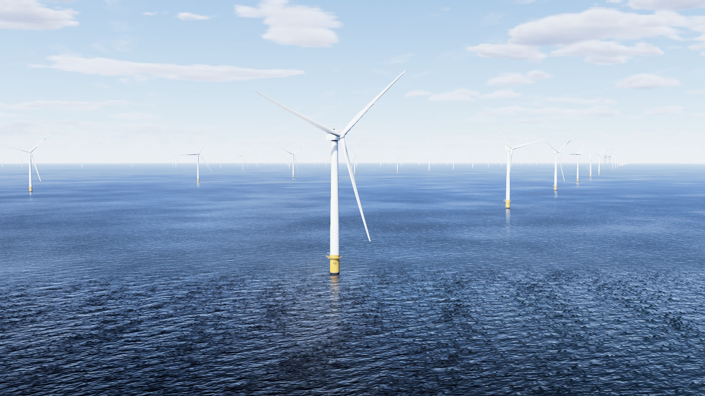
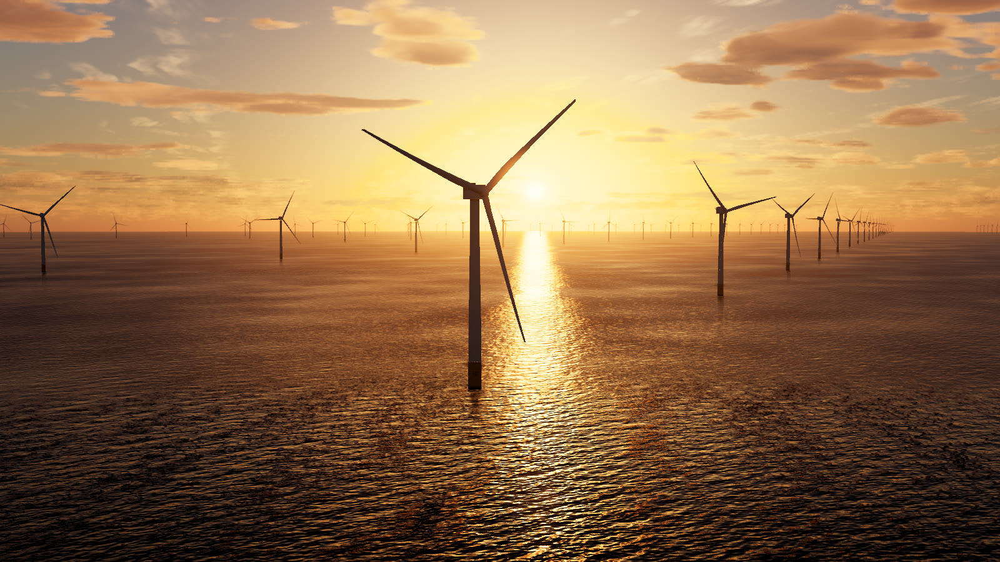
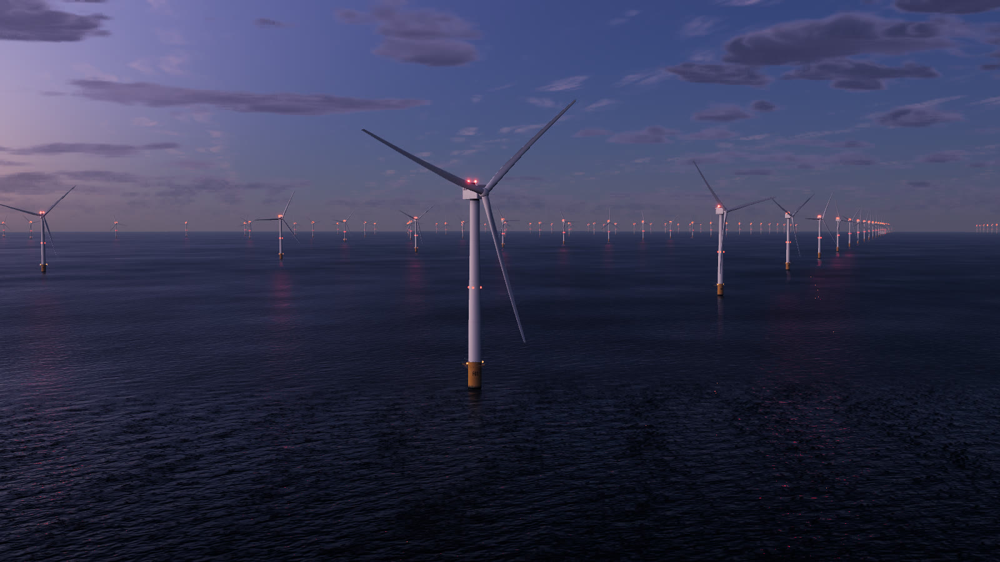
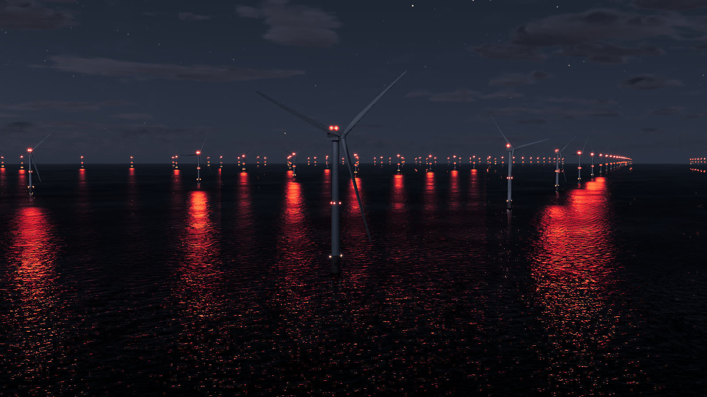
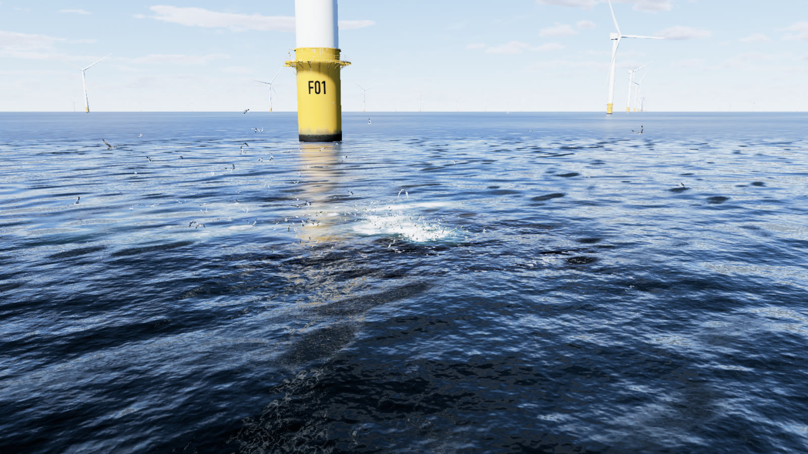
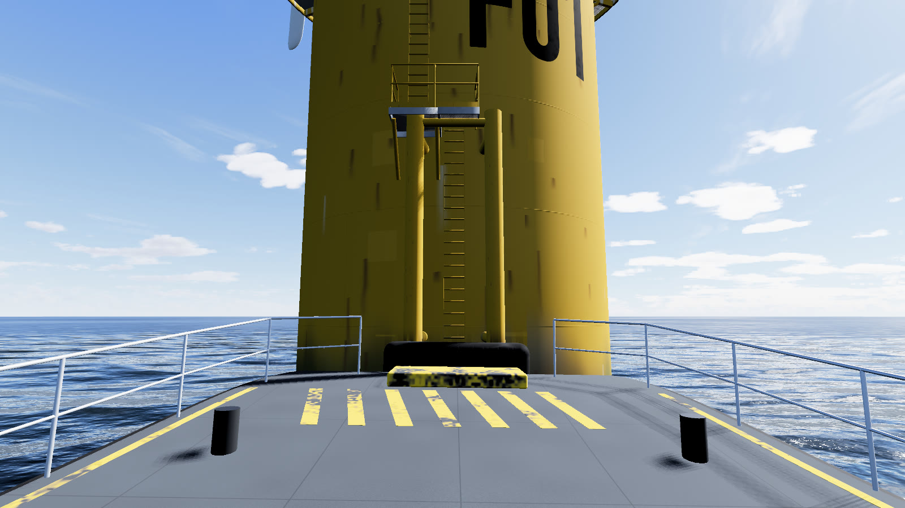
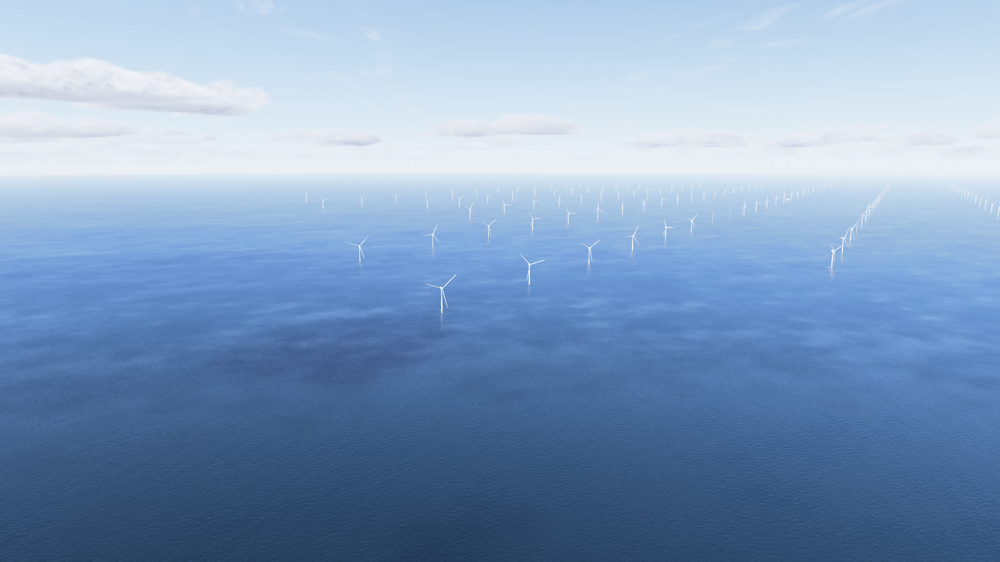

# Atlantic Shores South, at true scale

**Live in the browser: [kirt.lol/eleven-miles-out](https://kirt.lol/eleven-miles-out)**

A photoreal, fully procedural three.js scene of **Atlantic Shores Offshore Wind South**, the wind farm planned (not
built) off Atlantic City, New Jersey: all **200 turbines on the real BOEM positions**, each a **Vestas V236-15.0 MW**
(236 m rotor, 152 m hub, 270 m to the blade tip), about 18 km (11 miles) off Atlantic City, with a physically based sky, an FFT ocean, a
full day and night cycle and the FAA aviation lights flashing in unison across the farm.

**Nothing here is built.** The project's construction and operations plan was approved on 2024-10-01 and remanded
for reconsideration on 2026-08-10; as of this writing there are no turbines off New Jersey. The scene shows the
project as permitted.

Everything is generated in the browser: no textures, models or other files are downloaded (three.js itself comes from
a CDN). Units are metres and seconds throughout, and every modelled object registers its real size so a dev hook can
check it against the spec (`window.__scene.scaleReport()`, 92 rows).



| | |
|---|---|
|  |  |
|  |  |
|  |  |

## What is in the scene

- **The farm.** The 200 positions from BOEM's turbine-location layer (`research/asow-south-wtg-positions.csv`): rows
  1,111.6 m apart along 80.6° true, 1,852 m (one nautical mile) between rows, no jitter. The nearest turbine (row F,
  number 01, at 39.27716 N, 74.24830 W) sits at the scene's origin, 17.9 km from Atlantic City. The offshore
  substation is the project's "large" type on the same row. Rotors turn at the speed the wind gives them, yaw into
  it, and a few stand idle and feathered.
- **The turbine.** Blades lofted from the IEA 15 MW reference turbine scaled to the V236's 115.5 m blade (chord,
  twist, prebend), the nacelle, tower taper, transition piece in traffic yellow (RAL 1023) up to +21.5 m, the open
  grating platform, railings, boat landing, ladders, davit, painted IDs and weathering. US markings by default
  (solid light-grey blades); a toggle adds the red tip bands of the German reference photo.
- **Light.** The sun and moon from the NOAA and Meeus algorithms for the date and time at the site; a Rayleigh,
  Mie and ozone sky with multiple scattering; one volumetric stratocumulus layer and thin cirrus; the bright stars,
  the Milky Way, the moon's phase, Atlantic City's sky glow. Haze is calibrated so the transition pieces stay yellow
  out to about 15 km.
- **The sea.** A JONSWAP wind sea plus swell in GPU FFT cascades, a CPU copy of the same surface for everything that
  floats, the sky's polarised reflection (the drone view uses a polarising filter, as the reference photo's camera
  did), a planar mirror for the turbines, whitecaps above 5 m/s, wash at every pile, cloud and structure shadows.
- **Earth curvature is real geometry**: at 10 km the sea drops 7.8 m, so distant turbines sink below the horizon as
  in real photos.
- **Night.** Two L-864 red beacons per nacelle (2,000 cd) and four L-810 lights mid-mast flash together every 2 s
  across the whole farm; yellow marine lanterns blink by their US Coast Guard class at the edges and inside the
  array; their reflections break into glitter on the water. Aircraft-detection lighting (lights dark until an
  aircraft is near) is a toggle.
- **Life.** A crew transfer vessel (a 27 m aluminium catamaran) shuttles between turbines and holds on the nearest
  one's boat landing with a little thrust; a service operation vessel holds station 13.4 km to the south-east. Fish
  blitzes (striped bass, bluefish, false albacore, bluefin) drive bait to the surface near the structures, with
  gulls, terns and gannets working over them. Atlantic City's skyline stands on the horizon toward the west-north-west.

## Run it locally

It is plain ES modules with no build step. Serve the folder with any static file server and open it in a browser
with WebGL 2:

```
python3 -m http.server 8000          # or: npx serve, caddy file-server, ...
# then open http://localhost:8000/
```

Double-clicking `index.html` does not work: browsers do not load ES modules from a page opened straight from the disk.
The page needs an internet connection for three.js r180 (the import map points at cdn.jsdelivr.net) and a GPU with
WebGL 2 and `EXT_color_buffer_float` (any recent desktop or laptop, most phones on the Low tier).

## Controls

The panel (top right) sets the time of day, play/pause and speed (1×, 60×, 600×, 3600×), the month, the wind at
10 m (with its Beaufort force and the rotor speed), cloud cover, the six views, what is shown, and the quality tier.

| | |
|---|---|
| Mouse | left drag orbits (Shift, Ctrl or ⌘ + drag pans), right drag pans, wheel or trackpad pinch zooms |
| Touch | one finger orbits, two fingers pinch to zoom and move together to pan |
| Keyboard | Space plays or pauses time; 1–6 pick a view; B starts a blitz near the view; with the scene focused, arrows pan (Shift + arrows orbit) |

**Views:** 1 *Drone reference* (the reference photo's framing: 127.5 m up, 774 m from the nearest turbine),
2 *CTV deck* (from the bow of the crew boat on the boat landing, facing the transition piece), 3 *Nacelle roof* (the
heli-hoist deck at 160 m, across the farm), 4 *Blitz* (a low drone over a fish blitz), 5 *Farm overview* (900 m up,
4 km south-west, below the clouds), 6 *Cinematic* (a slow two-minute orbit).

### URL parameters

| parameter | |
|---|---|
| `time=16.5` | local time in hours (EDT/EST from the date); default 16:30 |
| `date=06-21` | month and day (2026); default 21 June |
| `view=drone` | `drone`, `deck`, `nacelle`, `blitz`, `overview` or `cinematic` |
| `q=high` (or `quality=`) | `low`, `med`, `high` or `ultra`; without it the tier follows the device and the resolution adapts |
| `wind=4.5` | wind at 10 m in m/s (sea state, rotor speed and pitch follow); default 4.5 |
| `clouds=0.28` | cloud cover 0–1 |
| `play=1`, `speed=60` | start with time running, at this many simulated seconds per second |
| `freeze=1`, `t=0` | hold all animation at animation time `t` seconds (for stills) |
| `seed=1` | the seed for the scene's random choices (which turbines stand idle, the blitzes, the birds) |
| `blitz=1` | start with a blitz where the Blitz view looks, near the nearest turbine |
| `ui=0` | hide the panel and the caption |
| `blitzes=0`, `birds=0`, `vessels=0` | hide the fish blitzes, the birds, the vessels |
| `photo=1` | the reference photo's red blade-tip bands |
| `adls=1` | aircraft-detection lighting (the red lights stay dark) |
| `cpl=0` | no polarising filter |
| `size=1920x1080` | an exact drawing-buffer size (a square: `size=1080`) |
| `capture=1` | frame-exact stepping for recordings: no animation loop; each `await window.__app.advance(1/60)` renders one deterministic frame |
| `depth=reversed` | reversed-Z depth instead of the logarithmic depth buffer (an A/B mode) |

`window.__scene` (always on this page) has `setTime(h)`, `setDate(m, d)`, `play(on)`, `setSpeed(x)`,
`setView(name)`, `setQuality(tier)`, `setWind(ms)`, `setClouds(cover)`, `triggerBlitz(x, z)`, `freeze(on)`,
`setToggle(name, on)`, `setCamera(x, y, z, headingDeg, pitchDeg, fovDeg)`, `scaleReport()`, `bench(frames)` and more
(see `src/main.js`).

## What is sourced and what is estimated

`research/SCENE-SPEC.md` holds every number the scene uses, each tagged **SOURCED** (stated by a cited source),
**DERIVED** (arithmetic on sourced numbers or on pixel measurements, with the working) or **ESTIMATED** (a judgement,
with its basis), and lists the sources (its §21). `src/config.js` carries the same numbers as code. In short:

| | Sourced | Derived or estimated |
|---|---|---|
| Layout | the 200 positions ([BOEM turbine locations](https://services7.arcgis.com/G5Ma95RzqJRPKsWL/arcgis/rest/services/Offshore_Wind_-_Proposed_or_Installed_Turbine_Locations/FeatureServer)); rows east-north-east, substation on a row ([BOEM PDE fact sheet](https://boem.gov/sites/default/files/documents/renewable-energy/state-activities/AtlanticShoresSouth_PDE.pdf)) | the lattice vectors fitted to the positions (0.04 m RMS); which position the substation takes |
| Turbine | V236-15.0 MW, 236 m rotor, 115.5 m blade ([Vestas](https://www.vestas.com/en/energy-solutions/offshore-wind-turbines/V236-15MW)); 270 m tip at Empire Wind ([Empire Wind](https://www.empirewind.com/about/technology/)); nacelle 11 × 9 m; tower base ≤ 10 m ([BOEM DEIS App. C](https://www.boem.gov/sites/default/files/documents/renewable-energy/state-activities/AtlanticShoresSouth_AppC_PDE%20and%20Max-Case%20Scenario_DEIS.pdf)) | hub 152 m (270 − 118); blade planform, tilt, cone, prebend scaled from the [IEA 15 MW reference turbine](https://github.com/IEAWindSystems/IEA-15-240-RWT); tower taper, nacelle and platform details; rotor speed law |
| Markings and lights | yellow transition piece, ID characters, lantern classes ([BOEM 2021 guidelines](https://www.boem.gov/sites/default/files/documents/renewable-energy/2021-Lighting-and-Marking-Guidelines.pdf), USCG NVIC 03-23); L-864 / L-810 count, intensity, flash rate and synchronisation (FAA AC 70/7460-1N); boat landing geometry (Carbon Trust OWA) | lamp sizes; beam fall-off below the horizontal; lantern placement on each structure |
| Site | tide datums ([NOAA CO-OPS 8534720](https://tidesandcurrents.noaa.gov/stationhome.html?id=8534720)); Atlantic City tower heights (Wikipedia); water depth range 19–37 m | depth at the nearest turbine (22 m); the camera pose that reproduces the reference photo; the sun for 21 June 16:30 ([NOAA solar equations](https://gml.noaa.gov/grad/solcalc/calcdetails.html)) |
| Sky and sea | summer wind, wave and cloud-base climatology (NDBC buoys 44009/44025/44091, ACY ASOS); aerosol depth (AERONET); water colour (ESA OC-CCI); [Bruneton's](https://github.com/ebruneton/precomputed_atmospheric_scattering) atmosphere coefficients | the default day (4.5 m/s from the SSW, Hs 0.67 m, 28 % cloud); haze, matched to the photo's look; the wave spectrum's shape |
| Vessels and wildlife | CTV 27 × 8.9 m ([StratCat 27](https://www.strategicmarine.com/product/stratcat-27-crew-transfer-vessel/)); SOV 80 × 19 m (ECO Liberty class); navigation lights (COLREGS); species sizes (Wikipedia species pages) | routes, holding behaviour, wakes, blitz behaviour, flight heights in the scene |

**The look** (camera, light, haze, sea, clouds) was matched to a photograph of **Borkum Riffgrund 1**, a German North
Sea wind farm of Siemens SWT-4.0-120 turbines with an 83 m hub
([Wikimedia Commons](https://commons.wikimedia.org/wiki/File:Borkum_Riffgrund_1.jpg)). The photo is **not included**
in this repository, and its turbines are not the ones modelled: the scene matches its look, not its machine. The
drone view reproduces its framing (vertical field of view 31.4°, the horizon on the same row); the farm, the turbine
and the markings are New Jersey's.

## Known differences from the photograph

Judged against the reference by three reviewers and measured frame by frame, the scene still differs in places:

- the nearest tower and blades are lit more evenly than in the photo (no deep shaded half);
- the near sea is shaded on the left, where the photo is bright, and a pale band sits just under the horizon;
- far turbines fade white-on-white without a shaded side;
- in the blitz view, the transition piece's reflection is a column of glitter;
- at night the lamp reflections are still strong close to each lamp;
- the dawn sea is copper to both edges; clouds are rounder than the photo's flat stratocumulus;
- the crew boat's superstructure is flat-shaded.

Performance has been measured only on an Apple M4 laptop whose GPU was busy with other work: about 5 ms a frame on
Low and 17–24 ms on High at 1600 × 900; Ultra at a device pixel ratio of 2 runs slower than 40 fps. These numbers are
not certified on an idle machine.

## Code layout

```
index.html            the standalone page: import map, canvas, control panel, caption
src/main.js           boot, frame loop, camera rig, quality tiers, URL parameters, window.__scene
src/config.js         every number from research/SCENE-SPEC.md, as code
src/shared.js         shared uniforms, Earth curvature, axes helpers, seeded random, the scale registry
src/env/              time.js (sun, moon, clock), atmosphere.js (sky, light, haze), clouds.js, sky-night.js
                      (stars, Milky Way), fog.js (aerial perspective for every material), land.js (Atlantic City)
src/ocean/            the FFT ocean, its shading, reflection, foam, wakes, splashes and distant light columns
src/turbine/          turbine.js (the V236, two levels of detail), substation.js, glyphs.js (painted IDs)
src/farm/farm.js      the 200 positions, instancing, far turbines, rotors and yaw, night lights
src/life/             vessels.js, blitz.js (fish blitzes), birds.js
src/post/post.js      HDR target, exposure on the sky, bloom, tone curve and grade
src/ui/               the control panel, the slim HUD for a host page, orbit controls, dev hooks
dev/                  one test page per module, with stand-ins for the others (dev/shell.html?stubs=ocean,farm)
research/             SCENE-SPEC.md (the numbers and their sources) and the research notes behind it
tools/shot.mjs        a headless screenshot and console harness
ARCHITECTURE.md       the build contract: units, axes, frame order, every module's interface
```

Units are metres; +X is east, +Y up, +Z south; the origin is the nearest turbine's foundation axis at mean sea
level. Every shader outputs linear HDR radiance; tone mapping happens once, in `src/post/post.js`.

### The screenshot harness

```
cd tools && npm ci && cd ..
node tools/shot.mjs --page index.html --query "view=drone&time=16.5&freeze=1&t=0&ui=0" --w 1600 --h 900 --out shots/drone.png
```

It serves the folder on a free localhost port, opens Chrome headless with the GPU, waits for the scene, saves the
screenshot and prints the console's errors and warnings as JSON (`--fps` samples the frame rate, `--dpr 2` emulates a
retina screen, `--eval "<js>"` runs an expression first). It uses the macOS Chrome by default; set `CHROME=` to
another Chrome or Chromium binary. The dev pages work the same way (`--page dev/ocean.html`).

## Credits

- [three.js](https://threejs.org) r180 (MIT licence, © three.js authors), loaded from jsDelivr.
- Methods: E. Bruneton's precomputed atmospheric scattering (coefficients) and S. Hillaire's multiple-scattering
  approximation; Pierson-Moskowitz and JONSWAP wave spectra; the NOAA solar position equations; Meeus's low-precision
  lunar position; the ACES filmic fit as shipped in three.js.
- Data: BOEM (turbine positions, project design envelope, lighting and marking guidelines), FAA (AC 70/7460-1N),
  US Coast Guard (NVIC 03-23, navigation rules), NOAA (CO-OPS tide datums, NDBC buoys), NASA AERONET, ESA Ocean
  Colour CCI, the Iowa Environmental Mesonet (ASOS), IEA Wind TCP Task 37 (IEA-15-240-RWT), the Yale Bright Star
  Catalogue (5th ed., bright-star positions and colours, transcribed), Wikipedia (building heights, species sizes).
  The full list with links is `research/SCENE-SPEC.md` §21.
- The reference photograph of Borkum Riffgrund 1 is on Wikimedia Commons (link above); it is not part of this
  repository.

## Licence

MIT (see `LICENSE`); three.js keeps its own MIT licence.
